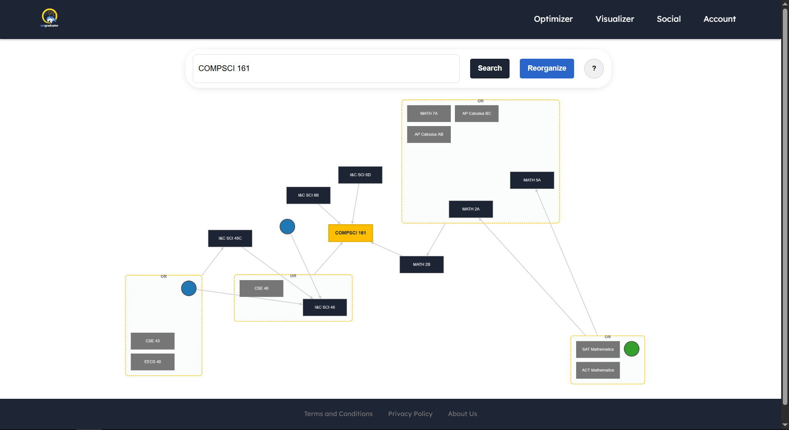
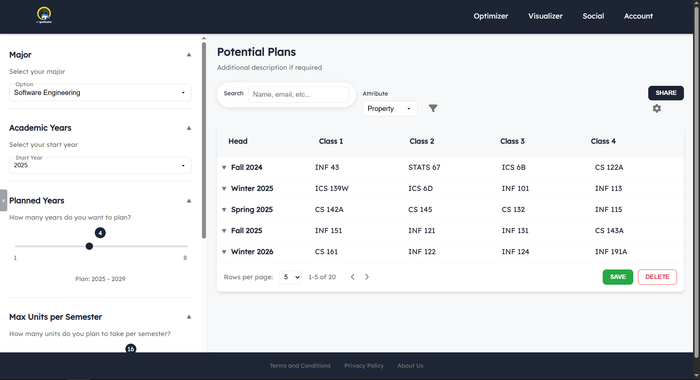

<div align="center">
  
  <h1>ZOTGRADUATOR</h1>
  <p><strong>Your path to graduation, simplified.</strong></p>
</div>

## 📚 About

Zotgraduator is a comprehensive academic planning tool designed specifically for University of California, Irvine students. It helps students navigate their academic journey efficiently by providing course planning, schedule optimization, and visualization tools to ensure they meet all graduation requirements while balancing their interests and career goals.

This project is a continuation and significant improvement of [Course Plan Optimizer](https://github.com/jasperdoan/course_plan_optimizer), originally created by [Jasper Doan](https://github.com/jasperdoan). The original tool used algorithmic techniques to build optimal academic schedules, and has now evolved into a full-featured web application with enhanced capabilities and user experience.

## 🚀 Features

### Course Visualization
Explore course prerequisites through an interactive, directed graph visualization. Understand the complex relationships between courses and identify core prerequisite chains that are crucial for your academic planning.

<div align="center">
  
</div>

### Schedule Optimization
Generate optimized course schedules based on your major requirements, completed courses, and preferences. Our algorithm creates conflict-free schedules that work with your preferences while ensuring you stay on track for graduation.

<div align="center">
  
</div>

### Additional Features
- **Academic Planning**: Create and manage multi-year academic plans
- **Requirement Tracking**: Monitor progress toward degree requirements
- **User Accounts**: Save and manage multiple schedules and academic plans
- **Social Features**: Connect with peers and get advice on courses and professors
- **Mobile-Responsive Design**: Access your plans on any device

## 💻 Tech Stack

- **Frontend**: ReactJS
  - Component-based architecture for modular UI development
  - Context API for state management
  - CSS for styling with responsive design
- **Backend**: Ruby on Rails
  - RESTful API design
  - PostgreSQL database for data storage
  - Authentication and authorization
- **Data Processing**:
  - Graph algorithms for prerequisite visualization
  - Constraint satisfaction algorithms for schedule optimization

## 🛠️ Installation

### Prerequisites
- Node.js (v14 or higher)
- Ruby (v3.0 or higher)
- Ruby on Rails (v7.0 or higher)
- PostgreSQL

### Setup

1. Clone the repository
```bash
git clone https://github.com/your-organization/zotgraduator.git
cd zotgraduator
```

2. Install frontend dependencies
```bash
cd frontend
npm install
npm start
```

3. Install backend dependencies
```bash
cd ../backend
bundle install
rails db:create
rails db:migrate
rails db:seed
rails server
```

4. Open your browser and navigate to `http://localhost:3000`

## 📖 How It Works

Zotgraduator uses a sophisticated algorithm to:

1. **Analyze Prerequisites**: We create directed acyclic graphs of course prerequisites to ensure logical course sequencing.

2. **Apply Constraints**: The system takes into account:
   - Major requirements
   - Course availability by quarter/semester
   - Prerequisites and corequisites
   - Maximum unit load preferences
   - Previously completed courses

3. **Optimize Schedules**: Using constraint satisfaction techniques, Zotgraduator generates optimal quarter-by-quarter plans that minimize time to graduation.

4. **Visualize Course Paths**: Interactive visualizations help students understand complex prerequisite chains and make informed decisions about their academic journey.

## 👥 Contributors

This project was developed by a team of Senior Software Engineering students from the Donald Bren School of Information and Computer Sciences at UC Irvine.

<table>
  <tr>
    <td align="center">
      <a href="https://github.com/CakeJamble">
        
        <br />
        <sub><b>Jake C</b></sub>
      </a>
    </td>
    <td align="center">
      <a href="https://github.com/connor-darling">
        
        <br />
        <sub><b>Connor D</b></sub>
      </a>
    </td>
    <td align="center">
      <a href="https://github.com/jasperdoan">
        
        <br />
        <sub><b>Jasper D</b></sub>
      </a>
    </td>
    <td align="center">
      <a href="https://github.com/mcdipples">
        
        <br />
        <sub><b>Sierra M</b></sub>
      </a>
    </td>
  </tr>
</table>

## 📄 License

This project is licensed under the MIT License - see the [LICENSE](LICENSE) file for details.
